# Wakanda Aerospace Agency

It's responsible for the management of Wakanda Aerospace. Launch satellites and manage the is one of its duty.

## WASA DNWS

The Department of National Weather Services manage the weather satellites. In this repository you will find the top-notch

### Solution's initial (very) draft

```mermaid
classDiagram
	class Coordinate
		Coordinate: latitude Double
		Coordinate: longitude Double

	class Zone
		Zone : startPoint Coordinate
		Zone : endPoint Coordinate
	
	class SatelliteType
		<<enum>> SatelliteType
		SatelliteType : WEATHER
		SatelliteType : INFRARED 

	class SatelliteEntity
		SatelliteEntity : id UUID
		SatelliteEntity : Zones List~Zone~
		SatelliteEntity : readingFrequency TimeUnit
		SatelliteEntity : isActive boolean
		SatelliteEntity : type SatelliteType
		SatelliteEntity : lastReading long

	class WindRose
		<<enum>> WindRose
		WindRose : N
		WindRose : NNE
		WindRose : NE
		WindRose : ENE
		WindRose : E
		WindRose : ESE
		WindRose : SE
		WindRose : SSE
		WindRose : S
		WindRose : SSW
		WindRose : SW
		WindRose : WSW
		WindRose : W
		WindRose : WNW
		WindRose : NW
		WindRose : NNW

	class AbstractSatelliteReadingMessage
		<<abstract>> AbstractSatelliteReadingMessage
		AbstractSatelliteReadingMessage : readingId UUID
		AbstractSatelliteReadingMessage : satelliteId UUID
		AbstractSatelliteReadingMessage : timestamp long
		AbstractSatelliteReadingMessage : Zones List~Zone~

	class WeatherSatelliteReadingMessage
		WeatherSatelliteReadingMessage : temperature Double
		WeatherSatelliteReadingMessage : windSpeed Double
		WeatherSatelliteReadingMessage : windDirection WindRose

	class ISatelliteService
		<<Interface>> ISatelliteService
		%% Executes a reading without change the already scheduled
		ISatelliteService : executeReading(UUID satelliteId)
		%% sets isActive as true and schedules readings
		ISatelliteService : activate(UUID satelliteId) boolean
		%% sets isActive as false and cancels future readings
		ISatelliteService : deactivate(UUID satelliteId) boolean
		%% save and schedule a read
		ISatelliteService : save(SatelliteEntity satellite) SatelliteEntity
		%% Deletes a satellite
		ISatelliteService : decommission(UUID satelliteId)
		%% Updates a satellite, cancels previous readings and schedules future readings
		ISatelliteService : updateReadingFrequency(UUID satelliteId, TimeUnit unit, short value)

	class SatelliteReadScheduler
		<<Service>> SatelliteReadScheduler
		%% Create the executor %%
		SatelliteReadScheduler : scheduleReadings(SatelliteEntity satellite) Schedule
		%% Create and send a kafka message %%
		SatelliteReadScheduler : read(UUID satelliteId) 

	%% Creates and send the message to kafka topic
	class SatelliteReadTaskExecutor~T~
		SatelliteReadTaskExecutor : ISatelliteService service
		SatelliteReadTaskExecutor : read() T

	WeatherSatelliteReadingMessage --|> AbstractSatelliteReadingMessage
```

### Satellite Controller

This controller handles various endpoints related to satellite management, such as listing all satellites, 
getting information about a specific satellite, updating satellite status, and creating/decommissioning satellites.

Right after its creation, and the readings frequency are changed, the reading task is scheduled at fixed rate.

Here's a brief overview of the functionalities:

1. GET /satellite:
   - List All Satellites (and there are a lot)
   - Method: listAll
   - Returns a list of all satellites either active or not.

2. GET /satellite/{satelliteId}:
   - Get Satellite by ID
   - Method: get
   - Returns information about a specific satellite.

3. GET /satellite/{satelliteId}/status:
   - Get Satellite Status by ID
   - Method: getStatus
   - Returns the status ("alive" or "hibernating") of a specific satellite.

4. POST /satellite/{satelliteId}/activate:
   - Activate Satellite. Enable the satellite to start to send readings 
   - Method: setStatusActive
   - Returns a success response or a bad request if activation fails.

5. POST /satellite/{satelliteId}/inactivate:
   - Deactivate Satellite. The satellite continues in orbit but do not send any reading
   - Method: setStatusInactive
   - Returns a success response or a bad request if deactivation fails.

6. POST /satellite/{satelliteId}/readingFrequency:
   - Update Reading Frequency
   - Method: updateReadingFrequency
   - Returns a success response or a bad request if the update fails.

7. POST /satellite:
   - Create Satellite
   - Method: createSatellite
   - Returns the created satellite or an internal server error if the creation fails.

8. DELETE /satellite/{satelliteId}:
   - Decommission Satellite. There's no come back from here. The satellite is invited to "dive into the Earth"
   - Method: decommission
   - Returns no content on success or a bad request if decommissioning fails.

## Next to be done

1. Implement a method to allow the stations to change the zone to be scanned
2. A listener (ApplicationReady) to read the satellite table and reschedule the readings
3. Authorization and Authentication (only Wakanda people should be able to use them)